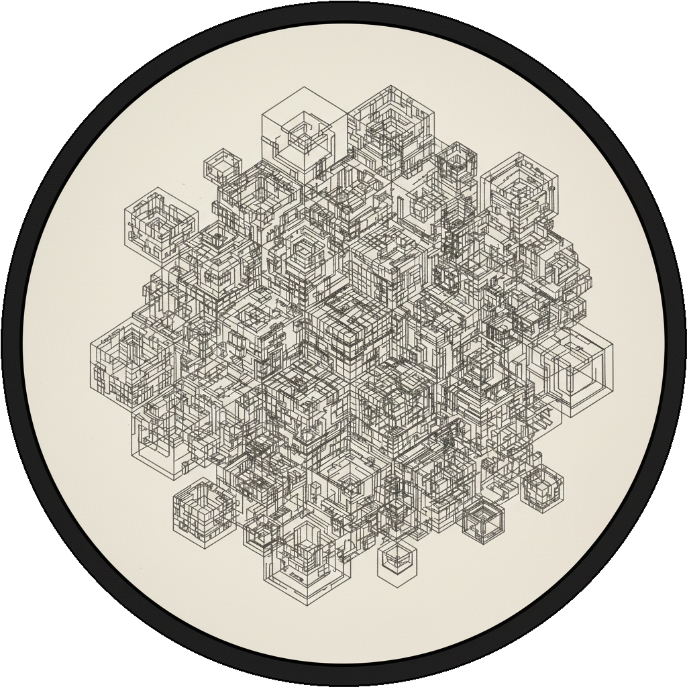
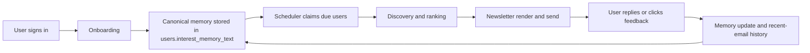
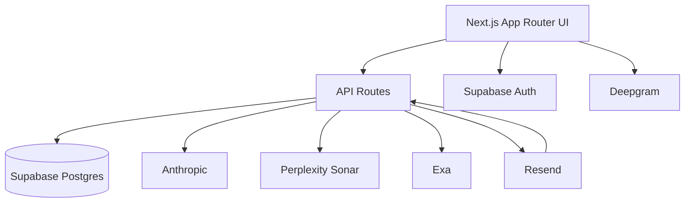
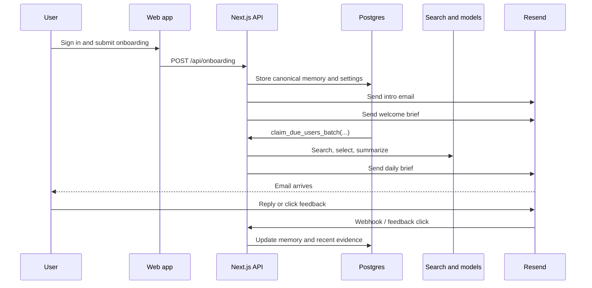

# <div align="center"></div>

# <div align="center">No Circles</div>

<p align="center">
  <strong>A website-first, personalized daily newsletter that learns from what each reader actually responds to.</strong>
</p>

<p align="center">
  Built as a single Next.js application with Supabase, Drizzle, Anthropic, Perplexity Sonar, Exa, Resend, and a deliberately minimal personalization model.
</p>

---

## Why This Exists

Most newsletter products either:

- blast the same links to everyone
- overfit to a narrow niche
- or write generic AI summaries that feel detached from the source material

No Circles takes a different approach:

- each user maintains one evolving text memory
- the system curates a fresh daily brief from that memory
- replies and one-click feedback update future issues
- summaries stay neutral, grounded, and short

The product goal is simple: send a brief every morning that feels useful, current, and personally relevant without becoming opinionated or bloated.

## What Is Implemented Today

This repository is not just a landing page or a prototype spec. The current codebase includes:

- Google sign-in via Supabase Auth
- a website homepage with a live sample brief pulled from a real sent daily issue
- onboarding with preferred name, timezone, send time, freeform interest input, and optional dictation support via Deepgram
- onboarding memory processing into a canonical 3-section profile:
  - `PERSONALITY`
  - `ACTIVE_INTERESTS`
  - `RECENT_FEEDBACK`
- an immediate intro email plus a separate 5-item welcome brief on first onboarding
- a DB-driven scheduler that claims due users in batches through Postgres and calls `POST /api/cron/generate-next`
- a send pipeline that:
  - optionally runs a bi-daily reflection pass over recent sent and reply emails
  - searches for candidate links with Perplexity Sonar
  - uses Anthropic to build queries, pick links, and choose serendipity topics
  - fetches final highlights with Exa
  - generates grounded summaries with Anthropic
  - filters repeats with a per-user Bloom filter
  - adds a personalized quote
  - renders a themed email
  - sends through Resend with outbound idempotency
- inbound reply processing through Resend webhooks with Svix verification and replay-safe memory updates
- one-click in-email `more like this` / `less like this` feedback links with signed tokens and idempotent handling
- recent sent/reply email storage for reflection, capped to the latest 5 of each kind per user
- unit and integration coverage across onboarding, memory updates, discovery, summary writing, send idempotency, feedback links, and cron selection

## Product Loop



## Runtime Architecture



## The Important Design Choices

### 1. Memory stays text-first

There is no large taxonomy of per-user topics, weights, preferences, and hand-built recommender tables.

Instead, each user has one canonical memory text that the system can:

- initialize from onboarding
- mutate from replies
- refine conservatively during reflection

That keeps the personalization model legible and easy to evolve.

### 2. Scheduling authority lives in Postgres

Due-user claiming is not inferred ad hoc in the app layer. A Supabase/Postgres function owns due-user selection and leasing, and the cron route runs bounded-concurrency send work for the claimed batch.

### 3. Repeat suppression is probabilistic and cheap

The system does not keep a row-per-link send history for anti-repeat behavior. It stores a per-user Bloom filter and checks candidate canonical URLs before final selection.

### 4. Reflection is deliberately narrow

For `daily` sends only, the pipeline can run a bi-daily reflection pass over the current memory plus the last 5 sent and last 5 reply emails. That pass may:

- keep memory unchanged
- rewrite canonical memory
- emit an ephemeral discovery brief for the current send only

This gives the system a self-correction layer without turning the architecture into a general-purpose agent framework.

## Current User-Facing Surface

### Web

- marketing/home page with sign-in and live sample brief preview
- onboarding flow
- OAuth callback route
- dynamic art route at `app/[art]/page.tsx`

### API routes

- `POST /api/onboarding`
- `POST /api/cron/generate-next`
- `POST /api/webhooks/resend/inbound`
- `GET /api/feedback/click`
- `GET /api/sample-brief`
- `GET /api/deepgram/token`

## Stack

| Area | Current choice |
| --- | --- |
| Web app | Next.js 15, React 19, TypeScript |
| Styling | Tailwind CSS, custom CSS, local component primitives |
| Auth | Supabase Auth via `@supabase/ssr` |
| Database | Supabase Postgres |
| ORM / migrations | Drizzle ORM, drizzle-kit |
| Discovery search | Perplexity Sonar |
| Highlight extraction | Exa |
| LLM tasks | Anthropic |
| Email delivery + inbound | Resend |
| Voice dictation | Deepgram |
| Validation | zod |
| Timezone logic | date-fns, date-fns-tz |
| Tests | Vitest |

## Repository Map

```text
app/            Next.js pages and API routes
components/     Shared UI components
lib/            Core domain logic, clients, prompts, helpers
db/             Migrations and Drizzle metadata
tests/          Unit and integration tests
scripts/        Operational SQL and maintenance helpers
documentation/  Source-of-truth product and architecture docs
.codex/         Durable learnings, state logs, and prompts
public/         Static assets
```

## Local Development

### 1. Install dependencies

```bash
npm install
```

### 2. Create `.env.local`

At minimum, local development needs the following environment variables:

```bash
DATABASE_URL=
NEXT_PUBLIC_SUPABASE_URL=
NEXT_PUBLIC_SUPABASE_ANON_KEY=

ANTHROPIC_API_KEY=
ANTHROPIC_MEMORY_MODEL=

PERPLEXITY_API_KEY=
EXA_API_KEY=

RESEND_API_KEY=
RESEND_FROM_EMAIL=
RESEND_WEBHOOK_SECRET=
CRON_SECRET=
```

### 3. Run the app

```bash
npm run dev
```

The `dev` script sources `.env.local` automatically before starting Next.js.

## Environment Variables

### Required for core app behavior

| Variable | Why it exists |
| --- | --- |
| `DATABASE_URL` | Postgres connection for Drizzle and runtime DB access |
| `NEXT_PUBLIC_SUPABASE_URL` | Supabase auth client/server setup |
| `NEXT_PUBLIC_SUPABASE_ANON_KEY` | Supabase auth client/server setup |
| `CRON_SECRET` | authorizes `POST /api/cron/generate-next` |
| `RESEND_API_KEY` | sends outbound email and fetches sample/inbound email content |
| `RESEND_FROM_EMAIL` | required sender address |
| `RESEND_WEBHOOK_SECRET` | verifies inbound Resend webhooks |
| `ANTHROPIC_API_KEY` | memory, reflection, summary, query, selection, and quote prompts |
| `ANTHROPIC_MEMORY_MODEL` | baseline fallback model for memory-adjacent tasks |
| `PERPLEXITY_API_KEY` | candidate link search |
| `EXA_API_KEY` | final article highlight extraction |

### Required for specific implemented features

| Variable | Feature |
| --- | --- |
| `FEEDBACK_LINK_SECRET` | signed in-email feedback tokens |
| `NEXT_PUBLIC_SITE_URL` | canonical public origin for feedback links |
| `DEEPGRAM_API_KEY` | server-side onboarding dictation token grants |
| `NEXT_PUBLIC_DEEPGRAM_CLIENT_API_KEY` | client bootstrap for onboarding dictation warmup |

### Optional model overrides

If omitted, several of these fall back to `ANTHROPIC_MEMORY_MODEL` or a nearby default in code.

- `ANTHROPIC_SUMMARY_MODEL`
- `ANTHROPIC_REFLECTION_MODEL`
- `ANTHROPIC_LINK_SELECTOR_MODEL`
- `ANTHROPIC_QUERY_BUILDER_MODEL`
- `ANTHROPIC_SERENDIPITY_MODEL`
- `ANTHROPIC_QUOTE_MODEL`

### Optional discovery / quote tuning

- `PERPLEXITY_SONAR_MODEL`
- `PERPLEXITY_SEARCH_CONTEXT_SIZE`
- `PERPLEXITY_SEARCH_DOMAIN_FILTER`
- `EXA_DISCOVERY_EXCLUDE_DOMAINS`
- `EXA_DISCOVERY_HIGHLIGHT_MAX_CHARACTERS`
- `EXA_FINAL_HIGHLIGHT_MAX_CHARACTERS`
- `HF_QUOTES_DATASET`
- `HF_QUOTES_CONFIG`
- `HF_QUOTES_SPLIT`
- `HF_QUOTES_TOTAL_ROWS`
- `HF_DATASET_ROWS_API_URL`
- `DISCOVERY_DEBUG`

## Validation

Safe default checks:

```bash
npm run lint
npm run build
```

Test commands also exist:

```bash
npm run test
npm run test:hyper
```

The `hyper` suite is for live/external integrations and is intentionally heavier.

## What This Repo Is Not Pretending To Be

This README is intentionally realistic:

- there is no mobile app
- there is no giant recommender system or vector database
- there is no separate reviewer model in the active pipeline
- there is no static curated source allowlist as the main discovery mechanism
- there is no fully general autonomous agent framework behind the scenes

The product is a focused system for:

- collecting reader intent
- curating a strong daily email
- learning from replies and feedback
- doing that reliably enough to operate every day

## Documentation

The source-of-truth docs live in [`documentation/`](./documentation).

Recommended reading order:

1. [`documentation/README.md`](./documentation/README.md)
2. [`documentation/vision.md`](./documentation/vision.md)
3. [`documentation/architecture.md`](./documentation/architecture.md)
4. [`documentation/subsystems/db-and-onboarding.md`](./documentation/subsystems/db-and-onboarding.md)
5. [`documentation/subsystems/inbound-reply-memory-update.md`](./documentation/subsystems/inbound-reply-memory-update.md)
6. [`documentation/subsystems/caring-reflection-memory.md`](./documentation/subsystems/caring-reflection-memory.md)

## High-Level Flow, End to End



## Status

The system currently has real onboarding, real persistence, real delivery logic, real inbound mutation paths, and real docs for the major subsystems. The main work now is quality hardening, prompt calibration, operational validation, and continuing to improve the homepage and newsletter experience without adding unnecessary architectural complexity.
