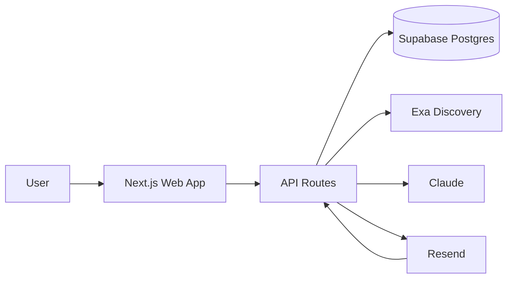
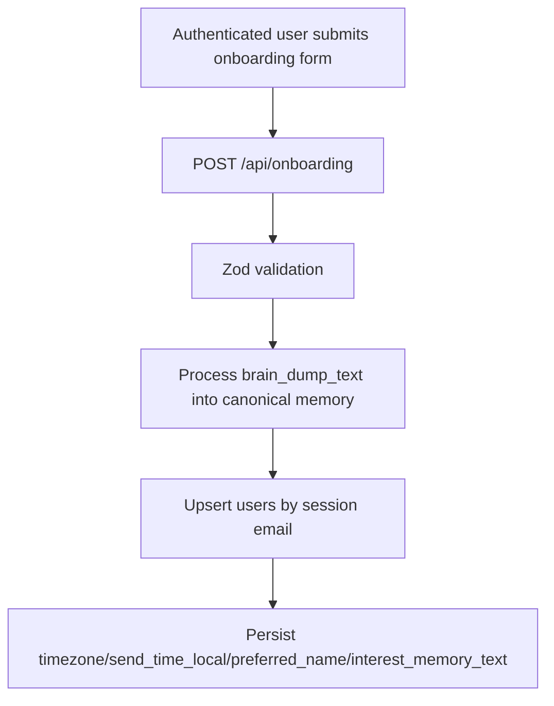
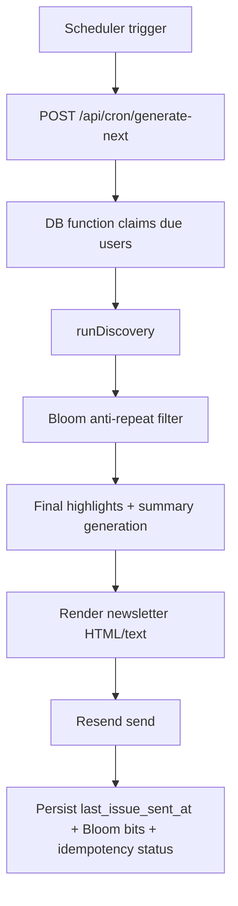
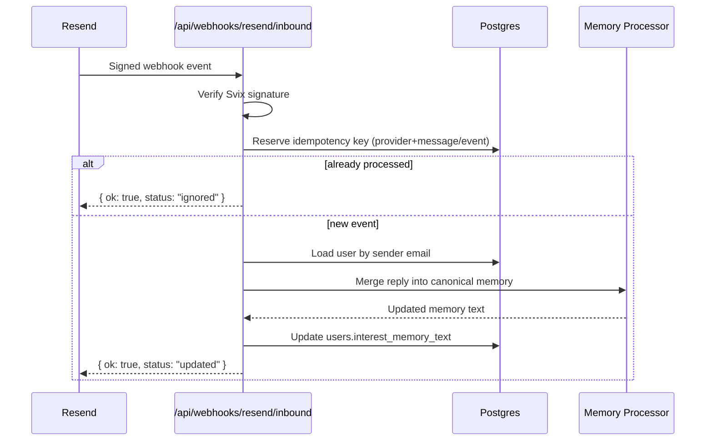

# No Circles

Website-first personalized newsletter system.

No Circles generates one daily email per user with 10 high-signal links tailored to that user's evolving interests, then updates user memory from inbound email replies.

## What It Does

- Collects onboarding context (`preferred_name`, `timezone`, `send_time_local`, `brain_dump_text`).
- Maintains one canonical per-user memory (`interest_memory_text`).
- Runs discovery and ranking to assemble 10 newsletter items.
- Uses per-user Bloom state to suppress repeated URLs.
- Sends newsletter via Resend.
- Processes inbound Resend replies and updates memory idempotently.

## Product Principles

- Curate, do not invent.
- Neutral summaries (no AI hot takes).
- Daily usefulness over stylistic flourish.
- Fast user-controlled adaptation through replies.

## Architecture At A Glance



## Core Runtime Flows

### 1) Onboarding



### 2) Scheduled Send Pipeline



### 3) Inbound Reply Memory Update



## Tech Stack

- Next.js + TypeScript
- Tailwind CSS + shadcn/ui
- Supabase Postgres + Drizzle ORM + drizzle-kit
- Exa (discovery)
- Claude Sonnet 4.5 (summary and memory processing)
- Resend (outbound + inbound)
- zod, date-fns/date-fns-tz
- Vitest + Playwright

## Repository Layout

- `app/` - pages and API routes
- `components/` - reusable UI
- `lib/` - core services, schemas, helpers
- `db/` - schema + migrations
- `tests/` - unit/integration tests
- `e2e/` - browser tests
- `scripts/` - operational scripts
- `documentation/` - source-of-truth design/architecture docs
- `.codex/` - memory and session logs

## API Surface (Current)

- `POST /api/onboarding`
- `POST /api/cron/generate-next`
- `POST /api/webhooks/resend/inbound`
- `GET /api/deepgram/token`

## Data Model (Core)

- `users`
  - identity + personalization state (`email`, `preferred_name`, `timezone`, `send_time_local`, `interest_memory_text`)
  - delivery state (`last_issue_sent_at`)
  - anti-repeat state (`sent_url_bloom_bits`)
- `processed_webhooks`
  - inbound replay protection (`provider`, `webhook_id`)
- `outbound_send_idempotency`
  - outbound dedupe and status tracking
- `cron_selection_leases`
  - lease tracking for scheduler selection

## Environment Variables

Required (runtime):

- `DATABASE_URL`
- `RESEND_API_KEY`
- `RESEND_WEBHOOK_SECRET`
- `CRON_SECRET`
- `ANTHROPIC_API_KEY`
- `EXA_API_KEY`

Common optional/config vars:

- `RESEND_FROM_EMAIL`
- `RESEND_REPLY_TO_EMAIL`

## Local Development

```bash
npm install
npm run dev
```

Useful shortcuts (if you use `just`):

```bash
just install
just dev
just lint
just build
```

## Testing

```bash
npm run lint
npm run build
```

Project also includes Vitest and Playwright suites under `tests/` and `e2e/`.

## Documentation

Start here:

- `documentation/README.md`

Then read in order:

1. `documentation/vision.md`
2. `documentation/architecture.md`
3. `documentation/subsystems/db-and-onboarding.md`
4. `documentation/subsystems/inbound-reply-memory-update.md`

## Current Status

Core onboarding, scheduler/send pipeline, Resend outbound delivery, and inbound webhook memory updates are implemented. Ongoing work focuses on quality hardening, discovery quality, and operational scaling.
